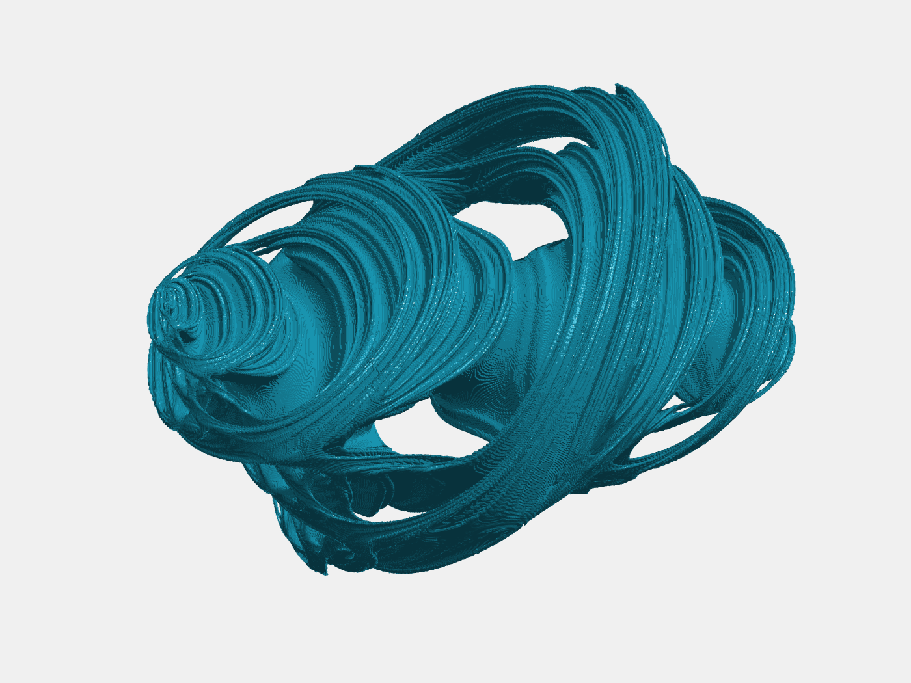

# Quaternion Julia Fractals
Projektarbeit zum Modul BZG1301 (Programmieren in Matlab) &amp; BZG1310 (Objektorientierte Geometrie)

## Beteiligte Personen:
Entwickler / Studenten:
 - Matthias Sidler (sidlm3)
 - Stefan Thöni (thons1)

Betreuung durch:
 - Marx Stampfli

## Abstract
Julia-Mengen sowie die Mandelbrot-Menge sind nicht nur in der komplexen Ebene, sondern auch im hyperkomplexen Raum der Quaternionen fraktal.
Diese Tatsache wurde in dieser Projektarbeit untersucht und es wurde ein kleines Matlab-Programm erstellt, welches diesen Fakt auf grafisch und künstlerisch hübsche weise präsentiert.

## Verzeichnisstruktur

Die Projektdokumentation sowie Unterlagen zu der Abschlusspräsentation sind im Root-Verzeichnis abgelegt.

Die finale Version des erstellten Programmes ist im Verzeichnis final abgelegt.

Alle restlichen Verzeichnisse dienen dem Dokumentieren von bestimmten Meilensteinen und haben lediglich Prototyp-Qualität.

Ein paar Beispiel-Bilder die mit Matlab generiert worden sind, sind im Ordner gallery zu finden.

## Systemanforderungen
Die Voraussetzungen für die Ausführung des finalen Programms sind:
- MATLAB, in Version R2017b getestet
- NVIDIA GPU mit CUDA Unterstützung, mind. 2 GB RAM
- CUDA Drivers von NVIDIA
- Mind. 16 GB freie RAM
Das benötigte Memory ist abhängig von der gewählten Samplingrate. Oben genannte Mindestanforderung an RAM gilt bei einer Samplingrate von 400.

## Matlab-referenzen
Folgende Matlab seiten sowie Beispiel-Code wurden extensiv benutzt bei der Erarbeitung dieses Projektes:
https://ch.mathworks.com/help/distcomp/examples/illustrating-three-approaches-to-gpu-computing-the-mandelbrot-set.html  
https://ch.mathworks.com/help/distcomp/parallel.gpu.cudakernel.html 

## Quellen
https://en.wikipedia.org/wiki/Mandelbrot_set  
https://en.wikipedia.org/wiki/Julia_set  
http://bugman123.com/Hypercomplex/  
https://en.wikipedia.org/wiki/Quaternion  
https://ch.mathworks.com  
http://paulbourke.net/fractals/quatjulia/   
